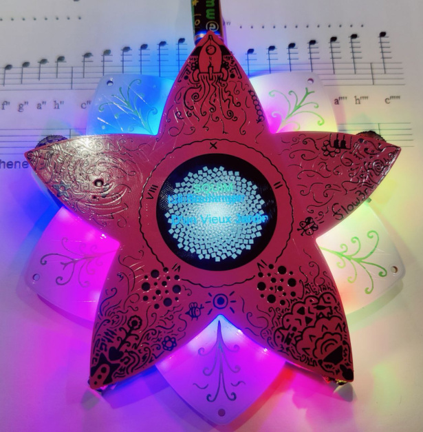

# SQUIM on flow3r

this is a micropython port of [SQUIM](https://github.com/wenzellabs/pico-square-immersion) (square immersion) to the [flow3r](https://flow3r.garden/).

it plays chords and notes as sqare waves controlled from a central [SQUIM player](https://github.com/wenzellabs/squim_player).

